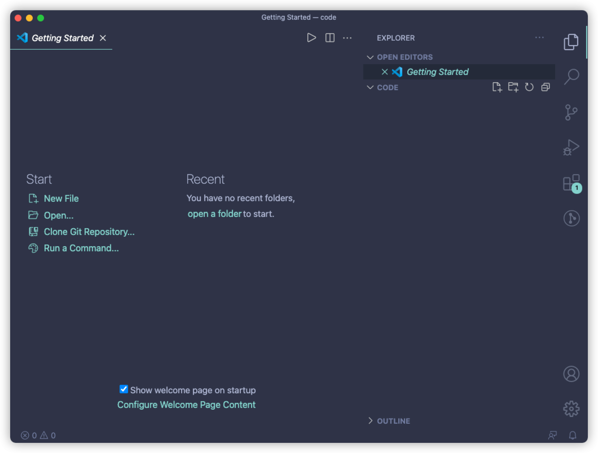
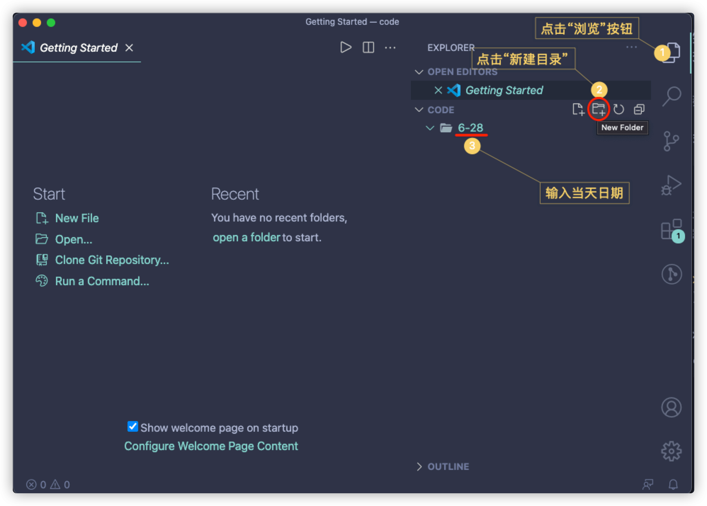
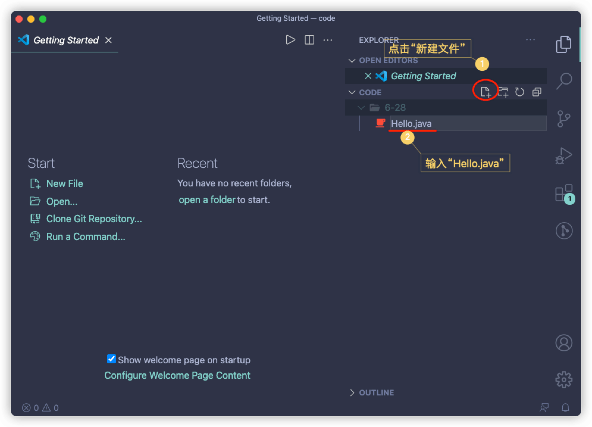
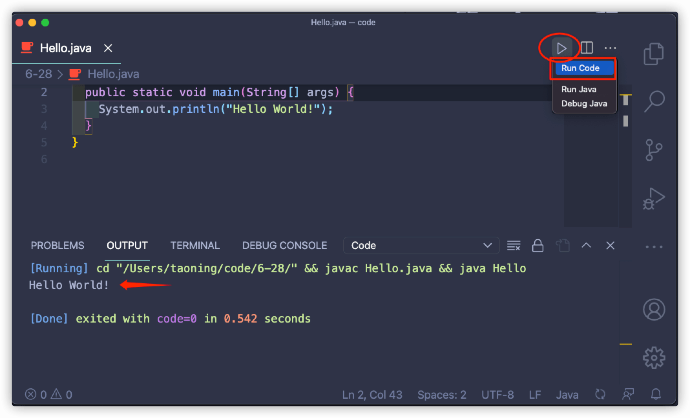

# 第一个 Java 程序

> 在[上一节](setup-java-env-from-scratch.md)中，已经详细讲解了如何在 Windows、macOS 系统上下载、安装 jdk 和 VSCode 及相应的扩展。
>
> 在程序界有一个不成文的传统：编程语言的第一个程序为`Hello World`，Java 也不例外。这节呢，我们就正式开始编写第一个 Java 程序。

## 工作目录创建

这一节将从“**工作目录创建**”开始，在本套教程的“**基础**”部分，我们都将在该目录里完成所有项目。

1. 在一个**你能找到的目录**下创建`code`文件夹。例如`D:\code\`（Windows）或`~/code/`（Linux / macOS）
2. 用 VSCode 打开该目录。
   你可以将该目录拖到 VSCode 中，也可以打开命令行，切换到该目录，输入`code .`打开。



## 每日学习目录创建



## Hello World!

1. 在**当天的学习目录**中新建`Hello.java`文件

   

2. 在`Hello.java`中敲入以下代码：

   当然，下面的代码是什么大家完全不用管，在后面的学习中将会逐步的讲解到。

   ```java
   public class Hello {
     public static void main(String[] args) {
       System.out.println("Hello World!");
     }
   }
   ```

3. 点击右上角类似**播放器**的按钮，点击`Run Code`，即可运行该代码（前提：已安装`Code Runner`插件）

   

至此，第一个 java 程序就编写完成了。
